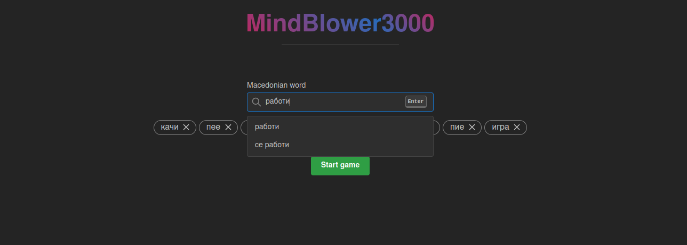
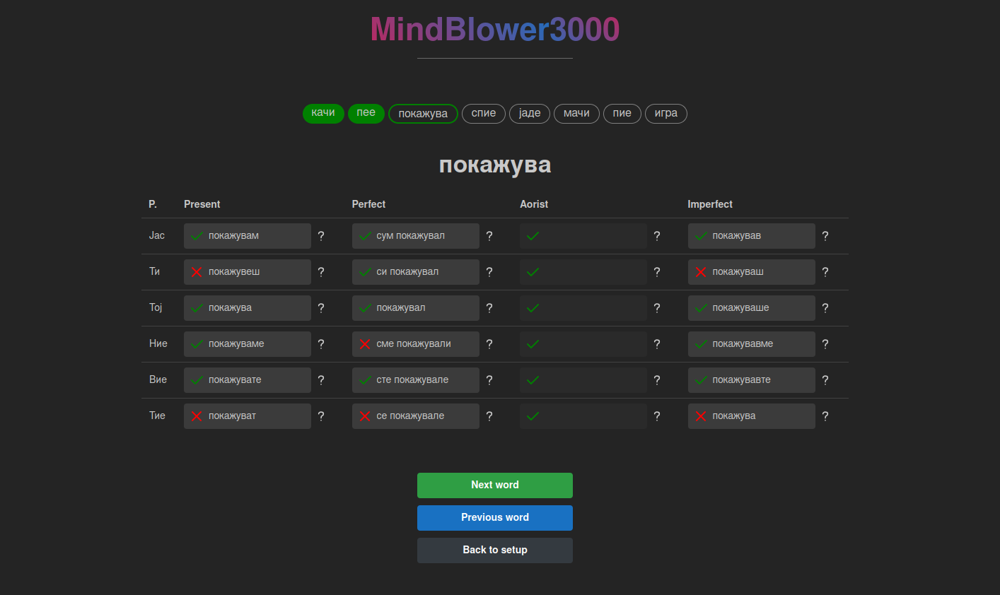

# MindBlower3000

- [MindBlower3000](#mindblower3000)
  - [Overview](#overview)
    - [Macedonian verbs](#macedonian-verbs)
  - [Setup \& run](#setup--run)
  - [Tech stack](#tech-stack)

## Overview
MindBlower300 is a local web application (backend + frontend) that has been created to implement some useful excersises/games to develop my skills in certain areas.

Available modules:

- Macedonian verbs

I will be adding more modules as I see fit, in the future ;-\)

### Macedonian verbs
In this module, I learn the conjugation of Macedonian verbs, especially in the past tense. Macedonian past tenses are grammatically quite difficult. There are rules for conjugation, but they are very large and difficult to learn from books. The only way to learn them is to conjugate a large number of verbs - the more the better.

A big thank you to the creators of the `Cooljugator.com` tool. It is a fantastic free resource for verbs and their conjugations. Thanks to it, I have access to over 3,000 Macedonian verbs. All the verbs to learn are automatically parsed from **Cooljugator** when needed.

Search for a verb and select the ones you want to learn:



Practice selected verbs in all past tenses:



## Setup & run

```bash
# Install dependencies and configure everything
./setup.sh

# Run application
./run.sh
```

The web application should be by available by default on `http://localhost:3000`.

## Tech stack

Backend:

- FastAPI + Pydantic
- BeautifulSoup4
- Requests

Frontend:

- React + Next.js
- Mantine UI framework
- Tabler icons
